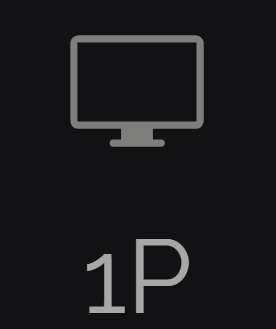
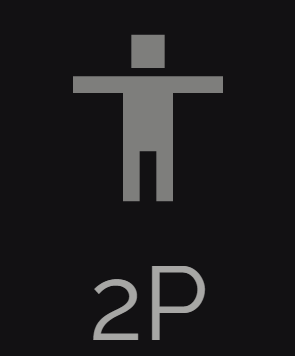
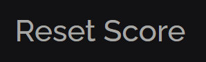

# TicTacToe mini-project

| Option                                                                              | Opponent Type   | Game                   | Scoreboard                                   |
| ----------------------------------------------------------------------------------- | --------------- | ---------------------- | -------------------------------------------- |
|  | `Computer`      | You vs Computer        | Does **NOT** reset the score `automatically` |
|      | `Friend`        | You vs Friend          | Does **NOT** reset the score `automatically` |
|          | `Opponent Type` | You vs `Opponent Type` | Resets `manually` Scoreboard to `0`          |

## About Opponent Types

1. `Computer`
   - After it detects your move, it takes somewhere between `0.6s` and `1.6s` to think.
2. `Friend`
   - Perfect for playing in `2`, but you can also play solo 🥸

> [!NOTE]
>
> #### Known Issue
>
> For mobile devices, sound effects are not stable (<ins>ref:</ins> _audio autoplay policies on mobile devices_)

**Play it here**: [Tic Tac Toe](https://loghindev.github.io/TicTacToe/)
